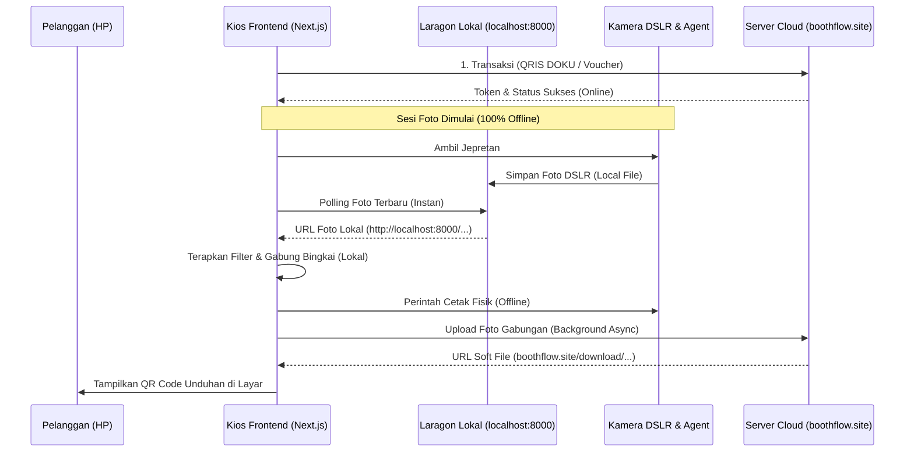

# Rencana Transisi Arsitektur Photobooth Hybrid (Local Processing & Cloud Sync)

Rencana ini bertujuan untuk memindahkan pemrosesan foto DSLR, filter visual, dan pencetakan ke server lokal (`localhost:8000` via Laragon), sehingga aplikasi Kios bebas dari kelambatan (*lagging* / *bottleneck* akibat jaringan internet lambat). Pembayaran dan hosting soft file (unduhan QR Code) tetap berjalan tersinkronisasi di server cloud (`boothflow.site`).

---

## 🔄 Alur Kerja Sistem (Hybrid Architecture Flow)



---

## 📋 Langkah-Langkah & Perubahan File

### 1. File DSLR Agent Lokal (Node.js Script di PC Kios)
* **Tujuan**: Menyimpan jepretan kamera langsung ke server Laragon lokal tanpa internet.
* **Perubahan**:
  * Ubah target upload foto dari:
    `https://boothflow.site/api/kiosk/receive-dslr-photo`
  * Menjadi alamat Laragon lokal Anda:
    `http://localhost:8000/api/kiosk/receive-dslr-photo`

### 2. File Kios [app/session-started/page.tsx](file:///D:/photobooth-frontend/app/session-started/page.tsx)
* **Tujuan**: Melakukan pencarian foto terbaru dari harddisk lokal secara instan.
* **Perubahan**:
  * Ganti URL pemanggilan `latest-photo` agar mengarah ke localhost Laragon:
    ```typescript
    // Baris ~218 & ~252:
    // Sebelum: getApiUrl("/api/kiosk/latest-photo")
    // Sesudah:
    const res = await fetch("http://localhost:8000/api/kiosk/latest-photo?t=" + Date.now());
    ```

### 3. File Kios [app/result/page.tsx](file:///D:/photobooth-frontend/app/result/page.tsx)
* **Tujuan**: Memproses penyimpanan cetak & QR secara asynchronous agar tidak memblokir user.
* **Perubahan**:
  * Proses `handlePrint` akan dipisah menjadi 2 bagian:
    1. **Bagian Lokal (Instan)**: Mengirimkan data cetak Base64 langsung ke agent printer lokal (`127.0.0.1:3001/print`) agar printer langsung jalan.
    2. **Bagian Cloud (Background)**: Mengunggah Base64 hasil gabungan ke `https://boothflow.site/api/sessions/save-photos` secara asinkron (*non-blocking*) hanya untuk mengambil link unduhan QR Code.

---

## 🚀 Keunggulan Transisi Ini
1. **0 Milidetik Lag**: Review foto dan transisi antar halaman sesi pemotretan akan terasa instan dan ringan karena tidak ada file puluhan megabyte yang harus diunggah ke internet saat user berada di dalam bilik.
2. **Kios Tetap Jalan Walau RTO**: Apabila internet lokasi tiba-tiba putus sebentar (*RTO*), sesi foto dan cetak fisik Kios tetap bisa diselesaikan hingga lembar foto keluar. Hanya penampilan QR Code yang akan menunggu internet terhubung kembali.
3. **Penggunaan Bandwidth Sangat Hemat**: Bandwidth internet lokal hanya terpakai sekitar 2-3MB per pengguna (hanya untuk satu kali upload foto final beresolusi sedang dan transaksi kasir), bukan puluhan megabyte foto raw DSLR.
